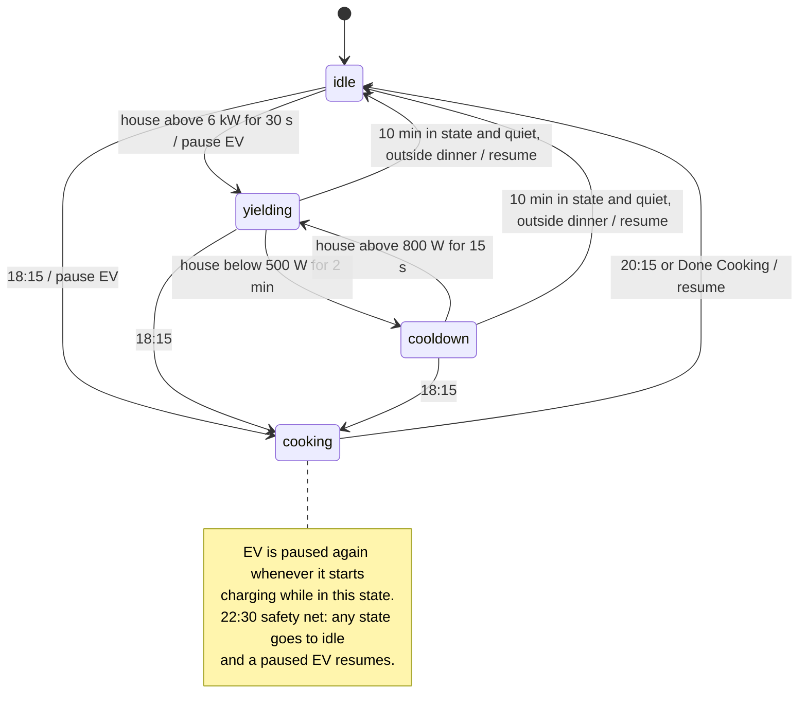
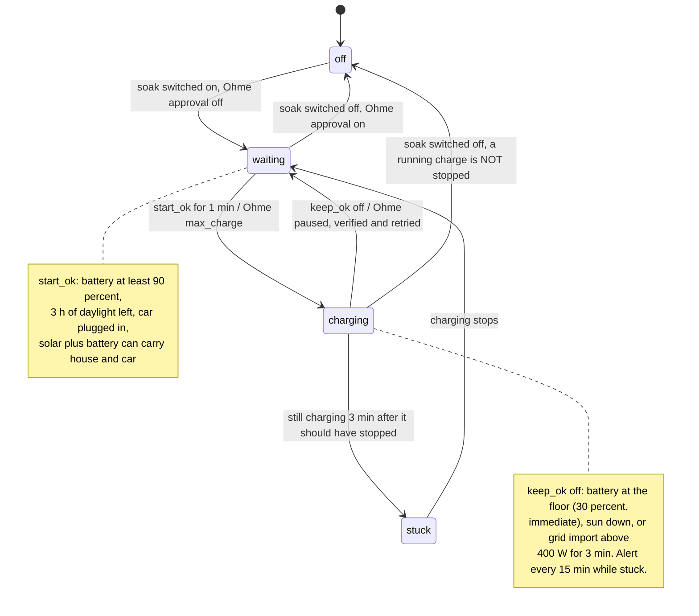
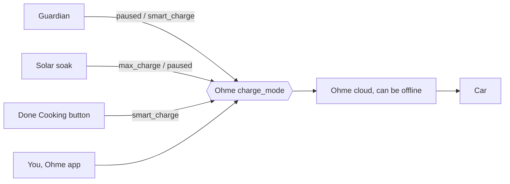

# Home Assistant Automations: 

## Objectives

1) Guardian: Flemish capacity-tariff peak control : keep home charging compatible with a 6kw peak 

2) Do not return energy to Fluvius, as it financially worthless
  - Use car to soak up surplus solar energy

3) Take advantage of overnight charging using the electricity company app to get better overnight prices.

## 6kW Capacity Guardian

This system manages EV charging and house load to ensure an approx **6.0 kW** monthly average peak in Flanders, Belgium. To avoid high capacity tariffs, we ensure the 15-minute average stays below 6kW:

- **Active Defense:** We monitor for **5 minutes above 6.5kW**.
- **Automatic Response:** If triggered, the EV charger is paused immediately.
- **Recovery:** Charging resumes once the load is low (< 4kW) or after the dinner peak.

---

## 📂 Core Automations

### 1. [ev-capacity-guardian.yaml](src/automations/ev-capacity-guardian.yaml)

> **Currently dormant (holiday mode):** all triggers are commented out so it cannot resume charging and fight the solar-soak controller. See the header in the file for how to re-enable it.

- **Power Guard:** Pauses EV if house draw > 6.0 kW for 30 seconds (`ev_guardian_state: yielding`).
- **Dinner Lockout:** Automatically pauses EV daily from **18:15 to 20:15** (`ev_guardian_state: cooking`). If a load pause (`yielding`/`cooldown`) is already running at 18:15 it hands over to `cooking`; at 20:15 `cooking` returns to `idle` and a paused EV resumes.
- **Smart Resume:** Moves to `cooldown` state after 2 minutes under 500W, and resumes charging once quiet for 10 minutes total or via the 22:30 safety net.

### 2. [ev-cooking-over-button-handler.yaml](src/automations/ev-cooking-over-button-handler.yaml)

- **Manual Resume:** Resumes EV charging immediately when the "Done Cooking" button is pressed, transitioning `cooking` state to `idle`.

### 3. [ev-approval-notifier.yaml](src/automations/ev-approval-notifier.yaml)

- **Reminder:** If Ohme is pending approval at 22:30, send reminder to both phones, with approve button.

### 4. [ev-approve.yaml](src/automations/ev-approve.yaml)

- **Button Handler:** Processes the "Approve" button click from "reminder" notification to start the charge.

### 5. [peak-alert.yaml](src/automations/peak-alert.yaml)

- **Awareness Only:** Sends a warning at **6.0 kW** (sustained for 2 mins). It does not take action; it just keeps you informed.

### 6. [ev-charge-completed.yaml](src/automations/ev-charge-completed.yaml)

- **Charge Completion:** Sends a notification to both phones when the Ohme charger finishes charging outside of Guardian pauses.

### 7. [ev-solar-soak.yaml](src/automations/ev-solar-soak.yaml), [ev-solar-soak-mode.yaml](src/automations/ev-solar-soak-mode.yaml) & [solar_soak.yaml](src/helpers/solar_soak.yaml)

- **Solar soak (while away):** charges the car from solar that would otherwise be exported, so no energy is wasted. The battery covers the gap between solar and the charger's 6 A minimum (~4.1 kW).
- **Start** (`binary_sensor.solar_soak_start_ok`, held 1 min): `ev_solar_soak` on, car plugged in, battery ≥ `soak_soc_start` (90 %), at least `soak_min_hours_left` (3 h) of daylight left, and solar + available battery discharge ≥ house + car draw. Sets Ohme to `max_charge`.
- **Stop** (`binary_sensor.solar_soak_keep_ok`): **at once** when the battery reaches `soak_soc_floor` (30 %) — the battery falls ~1 %/min with the car on, so there is no debounce and no 10 min gap for this — or when the sun is down, or after 3 min of grid import ≥ 400 W (`binary_sensor.solar_soak_grid_free`, so a passing cloud doesn't stop a charge). Sets Ohme to `paused`. Other mode changes are at least 10 min apart (Ohme is cloud-controlled).
- **Ohme drops offline sometimes, so stops are verified.** After setting `paused` the controller waits up to 90 s for confirmation (mode `paused` or no longer `charging`), retries once, and sends **"Solar Soak: COULD NOT PAUSE"** if it still cannot. Stop the car from its own app in that case.
- **Watchdog** (`ev-solar-soak-watchdog.yaml`, `binary_sensor.solar_soak_stuck`): if soak is on, Ohme says `charging` and the car should have stopped (battery at the floor, grid in use, sun gone, or Ohme offline) for 3 minutes, you get **"Solar Soak: car may still be charging"**, repeated every 15 minutes until it clears.
- The battery floor has hysteresis (3 points) so a level hovering at the floor does not flicker; the controller is `queued` so a trigger is not dropped while another run is waiting; 30 automation traces are kept for diagnosing failures.
- **Mode switch:** turning `ev_solar_soak` on switches Ohme "Require approval" off (nobody to press Approve); turning it off switches it back on.
- Battery stays in normal self-consumption (no Modbus control needed).

---

## 🧭 State Machines

Two machines run side by side and both write the same thing: Ohme's `charge_mode`. (GitHub renders these diagrams; the ASCII version in `src/helpers/guardian.yaml` is kept for people reading the YAML.)

### Guardian (`input_select.ev_guardian_state`) — dormant while away

### Solar soak (`ev_solar_soak` + binary sensors)

### The shared resource: Ohme charge mode

While away the guardian's triggers are commented out, so only solar soak (and you) write to the mode. See the header of `src/automations/ev-capacity-guardian.yaml` to bring it back.

---

## 🏠 Dashboard Widget

The system now includes a managed dashboard **Capacity Guardian** defined in `src/ui-lovelace.yaml` and is automatically deployed to Home Assistant alongside your automations and scripts.

To use it, ensure your Home Assistant is in **YAML Mode** for dashboards (this is handled by the included `configuration.yaml`).

The dashboard includes:

1.  **Guardian Status**: Real-time view of the `Idle`, `Yielding`, or `Cooldown` state.
2.  **Cooking Over Button**: Manual override to resume charging.
3.  **State explanation**: A markdown card detailing what each state means.

---

## 📜 Helper Scripts

### [notify_both_phones.yaml](src/scripts/notify_both_phones.yaml)

- A centralized script used by other automations to send alerts to both Pixel 10 and Pixel 8 simultaneously.

### [notify_simon.yaml](src/scripts/notify_simon.yaml) & [notify_partner.yaml](src/scripts/notify_partner.yaml)

- Targeted notification scripts for Pixel 10 (Simon) and Pixel 8 (Partner) individually.

---

## ⚙️ Configuration & Deployment

### File Structure

- **Automations:** Files in `src/automations/*.yaml` are copied as-is to `dist/src/automations/`. `configuration.yaml` picks them up with `!include_dir_list src/automations`, so each file must contain a single automation (with a stable `id:` field).
- **Scripts:** Files in `src/scripts/*.yaml` are copied as-is to `dist/src/scripts/`. `configuration.yaml` picks them up with `!include_dir_merge_named src/scripts`, so each file's content must be nested under a single top-level key matching the script's id (e.g. `notify_simon:`).
- **Helpers & Config:** Files in `src/helpers/` are copied to `dist/helpers/`, and `src/configuration.yaml` to `dist/`.
- **Web Assets:** Files in `src/www/` are copied to `dist/www/`.

Because HA resolves `!include_dir_*` paths relative to its config root, the deployed HA config directory needs a `src/automations/` and `src/scripts/` folder of its own — `combine.py --deploy` uploads `dist/src/` (via `rsync --delete`, so files removed locally are also removed on the HA host) alongside the usual flat files.

### 🚀 How to Update & Upload

1.  **Consolidate:** Run `./combine.py` to generate output in `dist/`.
2.  **Upload:** Run `./combine.py --deploy` (requires `.env` setup).
    - **Versioning:** The script uses the `VERSION` file in the root.
    - You must **manually** increment the version in the `VERSION` file before merging a PR to `main` (the CI check enforces this).
    - Alternatively, run `./combine.py --deploy -v 1.2.0` to update the file and deploy in one go.
    - This will upload automations, scripts, helpers, configuration, and web assets.
3.  **Reload:** Go to HA -> **Settings -> Tools -> YAML** -> click **Automations** and **Scripts**.
    - _Note:_ If `HA_DEPLOY` token is set in `.env`, the script will automatically trigger a reload and update the version state.

---

## 📝 TODO

* [x] Daily challenge: sum of energy produced - background use during sunny hours - battery capacity
  * [x] Update surplus prediction throughout the day
  * [x] Get more regular battery updates - modbus

* [ ] Turn off battery discharge when car charging — drafted via Modbus (`ecoflow-battery-lock.yaml`/`ecoflow-battery-unlock.yaml`, on `sh/eco-flow` branch)
  * [ ] Prevent the car consuming energy from the battery — see above, drafted not tested

* [ ] Get the car to take up the remaining capacity — drafted as solar soak (see above); thresholds to be tuned from real days, `max_charge` starting immediately is unverified

* [ ] **Ohme's power sensor sometimes reads a third of the real power.** From the recorder history, `sensor.ohme_home_pro_delta_11kw_power` normally equals 3 × current × voltage (29–30 Sep at 6 A: 4.13 kW from 5.84 A × 236 V; 2 Oct at 8 A: 5.57 kW from 7.83 A × 237 V). During the first solar-soak session (3 Oct 12:10, started with `max_charge`, battery supplying most of the power) it read 1.36 kW from 5.77 A × 235 V, i.e. 1 × current × voltage, although the car reported 6 A on three phases (~4.1 kW, matching EcoFlow `house_power`). Cause unknown; the current and voltage sensors look right in both cases. So do **not** multiply the power sensor by 3 (it is right in normal sessions). A template sensor `3 × current × voltage` would be correct in both. Check which entity the energy/power-flow card uses for the car. The solar-soak controller does not read Ohme's power.
  * Confirmed on the same test: the 6 A cap is in effect, and `max_charge` starts a session within seconds.

* [ ] Catch case when charging stops unexpectedly and not at 100% (not clear how we can know that)?

* [ ] Yield after slightly longer spike (perhaps linked to level) so coffee does not affect it?
